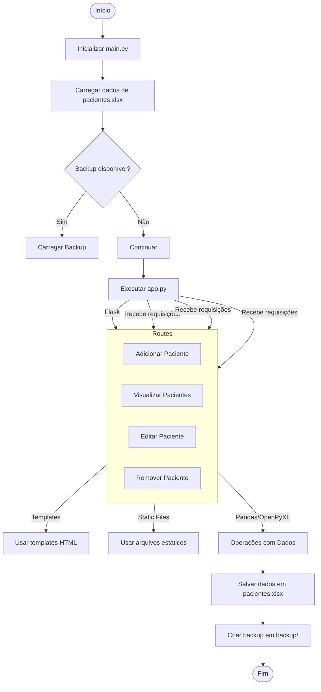

# Fluxograma do Sistema de Gerenciamento de Pacientes

Este fluxograma orienta a equipe sobre a estrutura do sistema, a interação entre os arquivos e as integrações utilizadas.

## Descrição do Fluxograma

- **Início**: O sistema é iniciado através do arquivo `main.py`.
- **Inicializar main.py**: Configura e executa a aplicação Flask definida em `app.py`.
- **Carregar dados de pacientes.xlsx**: Os dados são carregados usando `pandas` e `openpyxl`.
- **Verificar Backup**: O sistema verifica se há um backup disponível dos dados.
  - **Sim**: Carrega o backup disponível.
  - **Não**: Continua com os dados atuais.
- **Executar app.py**: Inicia a aplicação Flask que gerencia as rotas e a lógica do aplicativo.
- **Definição de Rotas**: As rotas em `app.py` incluem:
  - **Adicionar Paciente**
  - **Visualizar Pacientes**
  - **Editar Paciente**
  - **Remover Paciente**
- **Usar Templates HTML**: Renderização de páginas usando os templates em `templates/`.
- **Usar Arquivos Estáticos**: Estilos CSS e scripts JS da pasta `static/`.
- **Operações com Dados**: Manipulação dos dados dos pacientes.
- **Salvar dados em pacientes.xlsx**: Atualizações são salvas no arquivo Excel.
- **Criar backup em backup/**: Um backup é criado antes de cada salvamento.
- **Fim**: O ciclo se repete a cada interação do usuário.

## Integrações Utilizadas

- **Flask**: Framework web para rotas e renderização.
- **Pandas**: Manipulação e análise de dados.
- **OpenPyXL**: Leitura e escrita em arquivos Excel.
- **Jinja2**: Template engine para renderizar HTML.
- **Bootstrap**: Estilização e responsividade.
- **Outras Bibliotecas**:
  - `Werkzeug`
  - `itsdangerous`
  - `MarkupSafe`
  - `numpy`
  - `psutil`
  - `python-dateutil`
  - `requests`

## Arquivos Principais

- **main.py**: Ponto de entrada da aplicação.
- **app.py**: Contém as rotas e a lógica principal.
- **templates/**: Templates HTML (`index.html`, `adicionar.html`, etc.).
- **static/**: Arquivos estáticos (CSS, JS).
- **pacientes.xlsx**: Armazena os dados dos pacientes.
- **backup/**: Armazena backups dos dados.
- **logs/**: Logs do sistema.

## Observações

- **Dependências**: Listadas em `requirements.txt`.
- **Ambiente Virtual**: Recomenda-se o uso para instalar dependências.
- **Segurança**: `pacientes.xlsx` não deve ser compartilhado publicamente.
- **Versionamento**: O arquivo `.gitignore` está configurado para ignorar arquivos sensíveis.
